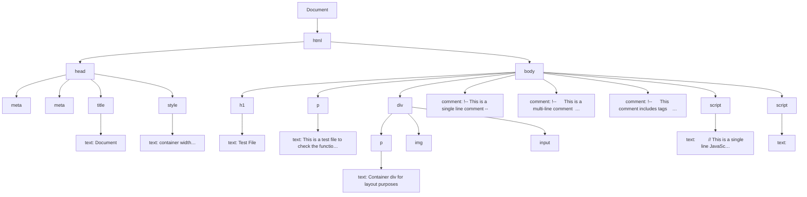

```mermaid
graph TD
    n0[Document]
    n0 --> n1
    n1[html]
    n1 --> n2
    n2[head]
    n2 --> n3
    n3[meta]
    n2 --> n4
    n4[meta]
    n2 --> n5
    n5[title]
    n5 --> n6
    n6[text: Document]
    n2 --> n7
    n7[style]
    n7 --> n8
    n8[text:          container              width…]
    n1 --> n9
    n9[body]
    n9 --> n10
    n10[h1]
    n10 --> n11
    n11[text: Test File]
    n9 --> n12
    n12[p]
    n12 --> n13
    n13[text: This is a test file to check the functio…]
    n9 --> n14
    n14[div]
    n14 --> n15
    n15[p]
    n15 --> n16
    n16[text: Container div for layout purposes]
    n14 --> n17
    n17[img]
    n14 --> n18
    n18[input]
    n9 --> n19
    n19[comment: !-- This is a single line comment --]
    n9 --> n20
    n20[comment: !--      This is a multi-line comment  …]
    n9 --> n21
    n21[comment: !--      This comment includes tags    …]
    n9 --> n22
    n22[script]
    n22 --> n23
    n23[text:          // This is a single line JavaSc…]
    n9 --> n24
    n24[script]
    n24 --> n25
    n25[text: ]
```
